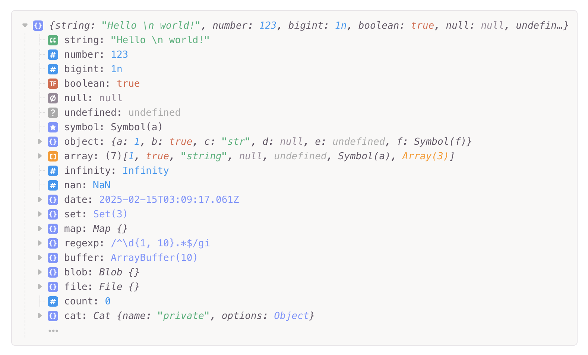

# react-object-viewer  

A flexible and lightweight object viewer component for React.  

> Inspired by [Runkit](https://runkit.com).  

```sh
npm install @lanyue/react-object-viewer
```

```js
import { ObjectViewer } from '@lanyue/react-object-viewer'
import '@lanyue/react-object-viewer/dist/style.css'

function App() {
  return (
    <ObjectViewer value={window} />
  )
}
```

**Preview**



## Props

**ObjectViewer** component props:

- **value**: `any` The value to be view.  
- **showLine**?: `boolean` - Show alignment line. Defaults to `false`.  
- **showLevel**?: `number` - Defines how many levels should be unfolded initially. Defaults to `1`.  
- **showItems**?: `number` - Specifies the number of items to render. Defaults to `20`.  
- **showInlineMax**?: `number` - Maximum number of items for inline rendering before switching to block format. Defaults to `50`.  
- **showIcon**?: `boolean` - Show type icon. Defaults to `false`.  
- **hideNonEnumerability**?: `boolean` - Hide non-enumerable properties. Defaults to `false`.  
- **sort**?: `number` - Sorting method for items:  
  - `0` (default) - No sorting  
  - `1` - Descending order  
  - `2` - Ascending order  
- **canClickLabelExtend**?: `boolean` - Allow clicking on the label to expand. Defaults to `false`.  
- **header**?: `ReactNode` - Custom header component.  
- **footer**?: `ReactNode` - Custom footer component.  
- **attrs**?: `React.ComponentProps<'div'>` - Additional attributes applied to the root `<div>` container.  
- **renderValue**?: `RenderValueFn` - Custom function to render values.  
- **renderTypeIcon**?: `(type: Type, descriptor: TypedPropertyDescriptor<any>, level: number, DefaultIcon: typeof RenderTypeIcon) => ReactNode`  
  - Custom function to render type icons.  
  - `DefaultIcon` refers to the built-in type icon renderer.  

## License

[MIT](./LICENSE)
