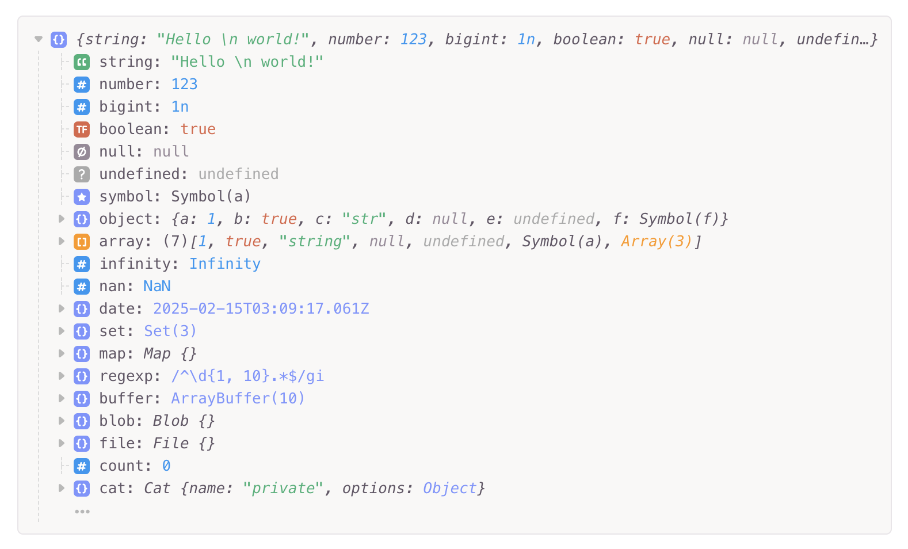

# react-object-viewer

A flexible and lightweight object viewer component for React. It supports nested
objects, arrays, functions, built-in JavaScript values, non-enumerable properties,
and custom node rendering.

Inspired by [RunKit](https://runkit.com).

[Live demo](https://mengdu.github.io/react-object-viewer/index.html)



## Installation

```sh
npm install @lanyue/react-object-viewer
```

## Usage

Import the component and its stylesheet:

```tsx
import { ObjectViewer } from '@lanyue/react-object-viewer'
import '@lanyue/react-object-viewer/dist/index.css'

const data = {
  name: 'react-object-viewer',
  values: [1, true, null, 'hello'],
  metadata: { language: 'TypeScript' },
}

export default function App() {
  return (
    <ObjectViewer
      value={data}
      expandLevel={1}
      showIndentLine
      showIcon
    />
  )
}
```

## Props

| Prop | Type | Default | Description |
| --- | --- | --- | --- |
| `value` | `any` | Required | The value to inspect. |
| `name` | `string` | - | A label displayed before the root value. |
| `className` | `string` | - | A class name applied to the root element. |
| `expandLevel` | `number` | `0` | Number of levels expanded initially. The root node is level `0`. |
| `showIndentLine` | `boolean` | `false` | Shows guide lines for nested values. |
| `showIcon` | `boolean` | `false` | Shows an icon for each property type. |
| `defaultShowItems` | `number` | `20` | Number of child properties shown per batch. |
| `showInlineMax` | `number` | `5` | Maximum number of array items or object properties shown in the collapsed inline preview. |
| `showNonenumerable` | `boolean` | `false` | Includes non-enumerable properties such as `[[Prototype]]`. |
| `canClickLabelExpand` | `boolean` | `false` | Allows clicking a value label to expand or collapse it. |
| `sort` | `Sort` | `Sort.DEFAULT` | Property order: `DEFAULT` (`0`), `DESC` (`1`), or `ASC` (`2`). |
| `nodeRenderer` | `(name, key, type, descriptor, level) => ReactNode` | - | Replaces the default renderer for each node label. |

## Custom node rendering

Use `nodeRenderer` to customize a label. `ObjectViewLabel` is exported so a
custom renderer can preserve the built-in label and add controls around it.

```tsx
import {
  ObjectViewer,
  ObjectViewLabel,
  type ObjectViewerProps,
} from '@lanyue/react-object-viewer'

const nodeRenderer: NonNullable<ObjectViewerProps['nodeRenderer']> = (
  name,
  key,
  type,
  descriptor,
  level,
) => (
  <>
    <ObjectViewLabel
      name={name}
      keyName={key}
      type={type}
      descriptor={descriptor}
    />
    {level > 0 && (
      <button
        type="button"
        onClick={(event) => {
          event.stopPropagation()
          navigator.clipboard.writeText(String(descriptor.value))
        }}
      >
        Copy
      </button>
    )}
  </>
)

export default function App() {
  return <ObjectViewer value={{ answer: 42 }} nodeRenderer={nodeRenderer} />
}
```

The package also exports `Sort`, `Type`, `ContextState`, `useOptions`, and the
built-in icons under the `icons` namespace.

## License

[MIT](./LICENSE)
